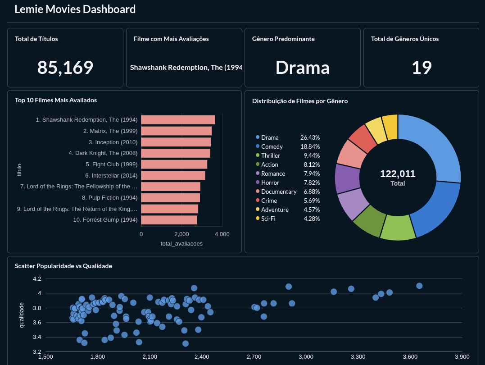
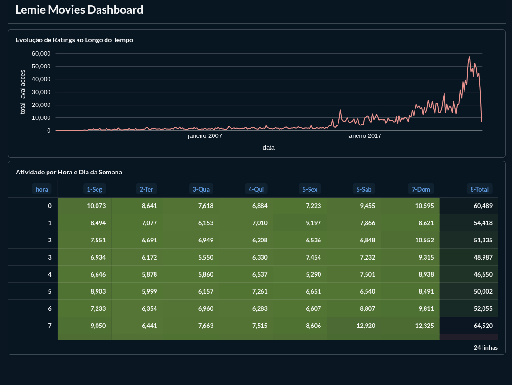
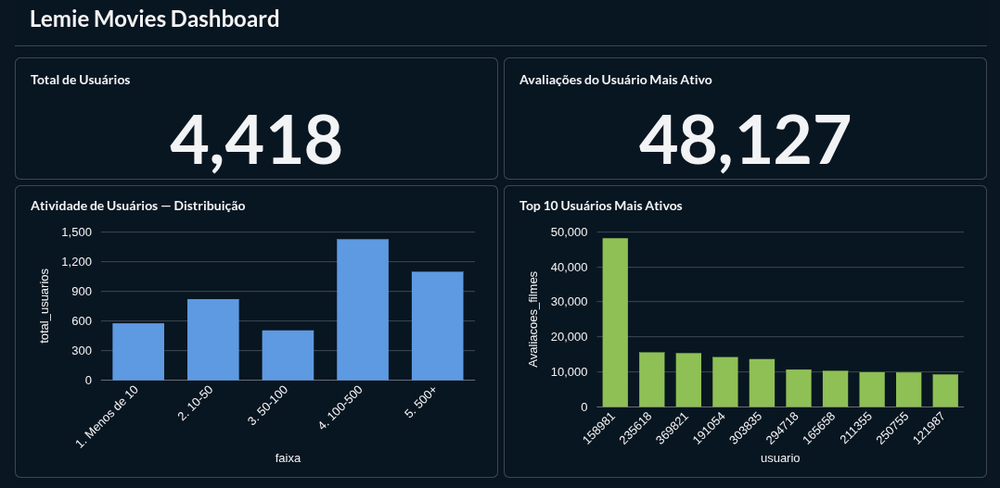

# 🎬 MovieLens Analytics

> **Desafio Técnico 01 — Case real com BigQuery e Metabase**
> Projeto desenvolvido como parte do desafio lançado pela comunidade [**Dados Por Todos**](https://www.instagram.com/dadosportodos) — ecossistema que conecta, ensina e desafia talentos da área de dados com aprendizado prático.

Pipeline de dados completo end-to-end para análise de filmes e ratings do dataset MovieLens, utilizando Google Cloud Platform, BigQuery e Metabase como ferramenta de BI.

> 🔗 **Dashboard público:** [metabase-production-e382.up.railway.app](https://metabase-production-e382.up.railway.app/public/dashboard/c57b3bc9-18a5-4147-8326-3d638cae2f89)

---

## 🏆 Sobre o Desafio

O **Dados Por Todos** lançou o **Desafio Técnico 01**, um case real utilizando BigQuery e Metabase com os seguintes 11 passos:

| # | Passo | Status |
|---|---|---|
| 1 | Baixar o dataset | ✅ |
| 2 | Subir os CSVs no Google Cloud Storage (GCS) | ✅ |
| 3 | Criar External Tables RAW no BigQuery | ✅ |
| 4.1 | Criar tabelas analíticas no BigQuery | ✅ |
| 4.2 | Criar tabelas analíticas no BigQuery | ✅ |
| 5 | Criar views analíticas no BigQuery | ✅ |
| 6 | Criar visualizações específicas | ✅ |
| 7 | Subir o Metabase com Docker | ✅ |
| 8 | Conectar o Metabase ao BigQuery | ✅ |
| 9 | Sincronizar o schema no Metabase | ✅ |
| 10 | Criar as Questions (gráficos) | ✅ |
| 11 | Montar o Dashboard | ✅ |

---

## 📊 Destaques do Dashboard

| Métrica | Valor |
|---|---|
| 🎬 Total de Títulos | **85.169** |
| 👤 Total de Usuários | **4.418** |
| ⭐ Total de Avaliações | **122.011** |
| 🏆 Filme Mais Avaliado | **The Shawshank Redemption (1994)** |
| 🎭 Gênero Predominante | **Drama (26,43%)** |
| 🗂️ Total de Gêneros Únicos | **19** |
| 🔥 Avaliações do Usuário Mais Ativo | **48.127** |

### 🖼️ Visualizações

**Página 1 — Filmes**
- **KPIs principais** — Total de títulos, filme mais avaliado, gênero predominante e total de gêneros únicos
- **Top 10 Filmes Mais Avaliados** — Shawshank Redemption, Matrix, Inception, Dark Knight, Fight Club...
- **Distribuição por Gênero** — Drama 26,43% · Comedy 18,84% · Thriller 9,44% · Action 8,12% · Romance 7,94%
- **Scatter Popularidade vs Qualidade** — Relação entre volume de avaliações e nota média por filme

**Página 2 — Atividade Temporal**
- **Evolução de Ratings ao Longo do Tempo** — Crescimento expressivo a partir de 2017, com pico de ~60.000 avaliações/mês
- **Heatmap — Atividade por Hora e Dia da Semana** — Maior atividade à meia-noite (60.489 total), pico nas madrugadas de domingo

**Página 3 — Usuários**
- **KPIs de Usuários** — 4.418 usuários únicos, usuário mais ativo com 48.127 avaliações
- **Distribuição de Atividade** — Maioria dos usuários na faixa de 100–500 avaliações (~1.450 usuários)
- **Top 10 Usuários Mais Ativos** — Usuário 158981 com quase 50.000 avaliações, muito acima da média

---

## 🏗️ Arquitetura do Pipeline

```
┌─────────────────────────────────────────────────────────────────┐
│                        FONTE DE DADOS                           │
│                   MovieLens Dataset (CSV)                       │
└────────────────────────────┬────────────────────────────────────┘
                             │  Passo 1: Download
                             ▼
┌─────────────────────────────────────────────────────────────────┐
│            🟤 BRONZE — Google Cloud Storage (GCS)               │
│            bucket: projeto_dados_movielens/bronze/              │
│                                                                 │
│  movies.csv · belief_data.csv · ratings_for_additional_         │
│  users.csv · user_rating_history.csv · Rhistory.csv ·           │
│  movie_elicitation_set.csv · user_recommendation_history.csv    │
└────────────────────────────┬────────────────────────────────────┘
                             │  Passo 2: Upload GCS
                             │  Passo 3: External Tables
                             ▼
┌─────────────────────────────────────────────────────────────────┐
│           🟤 BRONZE — BigQuery · dados_brutos                   │
│                  (External Tables — RAW)                        │
│                                                                 │
│  Rhistory · belief_data · movie_elicitation_set · movies ·      │
│  ratings_for_additional_users · user_rating_history ·           │
│  user_recommendation_history                                    │
│                                                                 │
│  ⚠️  Todas as colunas definidas como STRING                     │
└────────────────────────────┬────────────────────────────────────┘
                             │  Passos 4.1 e 4.2: SQL Transformations
                             │  SAFE_CAST · REGEXP_EXTRACT · UNION ALL
                             ▼
┌─────────────────────────────────────────────────────────────────┐
│            ⚪ SILVER — BigQuery · dados_silver                  │
│                  (Tabelas Transformadas)                        │
│                                                                 │
│  dim_movies ──── movieId · title · genres · ano_lancamento      │
│  fact_ratings ── userID · moveID · rating · tstamp              │
└────────────────────────────┬────────────────────────────────────┘
                             │  Passo 5: Views Analíticas
                             │  LEFT JOIN · GROUP BY · EXTRACT
                             ▼
┌─────────────────────────────────────────────────────────────────┐
│             🟡 GOLD — BigQuery · dados_gold                     │
│                   (Views Analíticas)                            │
│                                                                 │
│  vw_movie_kpis · vw_top_movies · vw_ratings_heatmap ·           │
│  vw_scatter_popularity_vs_quality · vw_user_activity ·          │
│  vw_genre_performance                                           │
└────────────────────────────┬────────────────────────────────────┘
                             │  Passos 7–11: Docker + Railway + Dashboard
                             ▼
┌─────────────────────────────────────────────────────────────────┐
│                   🟢 BI — Metabase                              │
│                                                                 │
│  🐳 Local:   docker run -p 3000:3000 metabase/metabase          │
│              http://localhost:3000                              │
│                                                                 │
│  🌐 Online:  Railway                                            │
│              metabase-production-e382.up.railway.app            │
└─────────────────────────────────────────────────────────────────┘
```

---

## 🛠️ Tecnologias Utilizadas

| Tecnologia | Camada | Descrição |
|---|---|---|
| **Google Cloud Storage** | Bronze | Armazenamento dos CSVs brutos |
| **BigQuery** | Bronze / Silver / Gold | Data Warehouse, SQL e Views |
| **GoogleSQL** | Silver / Gold | SAFE_CAST, REGEXP_EXTRACT, UNION ALL, LEFT JOIN |
| **Docker** | BI | Containerização local do Metabase |
| **Railway** | BI | Deploy público do Metabase online |
| **Metabase** | BI | Dashboard interativo com gráficos e KPIs |

---

## 🗂️ Estrutura de Dados

### 🟤 Bronze — `dados_brutos` (7 External Tables)

| Tabela | Descrição |
|---|---|
| `movies` | Catálogo de filmes com título e gêneros |
| `ratings_for_additional_users` | Avaliações de usuários adicionais |
| `user_rating_history` | Histórico de avaliações por usuário |
| `belief_data` | Dados de crenças e predições de rating |
| `movie_elicitation_set` | Conjunto de filmes para elicitação |
| `user_recommendation_history` | Histórico de recomendações |
| `Rhistory` | Histórico adicional de ratings |

### ⚪ Silver — `dados_silver` (2 Tabelas)

**`dim_movies`**
| Coluna | Tipo | Descrição |
|---|---|---|
| movieId | STRING | ID do filme |
| title | STRING | Título do filme |
| genres | STRING | Gêneros separados por pipe `\|` |
| ano_lancamento | STRING | Ano extraído do título via `REGEXP_EXTRACT` |

**`fact_ratings`**
| Coluna | Tipo | Descrição |
|---|---|---|
| userID | INT64 | ID do usuário |
| moveID | INT64 | ID do filme |
| rating | FLOAT64 | Nota dada ao filme (0.5 a 5.0) |
| tstamp | TIMESTAMP | Data e hora da avaliação |

### 🟡 Gold — `dados_gold` (6 Views)

| View | Descrição |
|---|---|
| `vw_movie_kpis` | KPIs por filme: total de avaliações e média de rating |
| `vw_top_movies` | Top 10 filmes por rating médio |
| `vw_ratings_heatmap` | Atividade de ratings agrupada por ano e mês |
| `vw_scatter_popularity_vs_quality` | Popularidade vs qualidade por filme |
| `vw_user_activity` | Quantidade de avaliações e última atividade por usuário |
| `vw_genre_performance` | Média de rating e total de avaliações por gênero |

---

## 🚀 Como Reproduzir

### Pré-requisitos
- Conta Google Cloud com BigQuery e GCS habilitados
- Docker instalado

### Passo a passo

**1. Download do dataset**
```bash
# Baixe o dataset MovieLens em: https://grouplens.org/datasets/movielens/
```

**2. Upload para o GCS**
```bash
gsutil cp *.csv gs://seu-bucket/bronze/
```

**3. Criar External Tables no BigQuery**
```sql
CREATE OR REPLACE EXTERNAL TABLE `projeto.dados_brutos.movies`
(
  movieId STRING,
  title   STRING,
  genres  STRING
)
OPTIONS (
  format = 'CSV',
  uris   = ['gs://seu-bucket/bronze/movies.csv']
);
```

**4. Criar tabelas Silver**
```sql
-- dim_movies
CREATE OR REPLACE TABLE `projeto.dados_silver.dim_movies` AS
SELECT
  movieId,
  title,
  genres,
  REGEXP_EXTRACT(title, '\\((\\d{4})\\)') AS ano_lancamento
FROM `projeto.dados_brutos.movies`
WHERE title != 'title';

-- fact_ratings (unificação de 2 tabelas)
CREATE OR REPLACE TABLE `projeto.dados_silver.fact_ratings` AS
SELECT
  SAFE_CAST(userID AS INT64)     AS userID,
  SAFE_CAST(moveID AS INT64)     AS moveID,
  SAFE_CAST(rating AS FLOAT64)   AS rating,
  SAFE_CAST(tstamp AS TIMESTAMP) AS tstamp
FROM `projeto.dados_brutos.ratings_for_additional_users`
WHERE rating != 'rating'
UNION ALL
SELECT
  SAFE_CAST(userID AS INT64)     AS userID,
  SAFE_CAST(moveID AS INT64)     AS moveID,
  SAFE_CAST(rating AS FLOAT64)   AS rating,
  SAFE_CAST(tstamp AS TIMESTAMP) AS tstamp
FROM `projeto.dados_brutos.user_rating_history`
WHERE rating != 'rating';
```

**5. Criar Views Gold**
```sql
CREATE OR REPLACE VIEW `projeto.dados_gold.vw_movie_kpis` AS
SELECT
  dm.movieId,
  dm.title,
  dm.genres,
  COUNT(*)       AS total_avaliacoes,
  AVG(fr.rating) AS media_rating
FROM `projeto.dados_silver.dim_movies` AS dm
LEFT JOIN `projeto.dados_silver.fact_ratings` AS fr
  ON SAFE_CAST(dm.movieId AS INT64) = fr.moveID
GROUP BY dm.movieId, dm.title, dm.genres;
```

**6. Subir Metabase com Docker**
```bash
docker run -d -p 3000:3000 --name metabase metabase/metabase
# Acesse: http://localhost:3000
```

**7. Conectar ao BigQuery**
- Vá em **Admin → Banco de dados → Adicionar banco de dados**
- Selecione **BigQuery**
- Informe o **Project ID** e faça upload do **Service Account JSON**
- Permissões necessárias: `BigQuery Data Viewer` · `BigQuery Job User` · `BigQuery Metadata Viewer`
- Sincronize: **Admin → Banco de dados → Sync database schema**

**8. Acesso público via Railway**

O Metabase está deployado no Railway para acesso público sem necessidade de login:
> 🌐 [metabase-production-e382.up.railway.app](https://metabase-production-e382.up.railway.app/public/dashboard/c57b3bc9-18a5-4147-8326-3d638cae2f89)

---

## 👤 Autor : Matheus Araújo 👨🏻‍💻

Projeto desenvolvido como parte do **Desafio Técnico 01** da comunidade [**Dados Por Todos**](https://www.instagram.com/dadosportodos).

---

## 🖼️ Prints do Dashboard

**Página 1 — Filmes**



**Página 2 — Ratings ao Longo do Tempo**



**Página 3 — Usuários**



---

## 📄 Licença

Dataset [MovieLens](https://grouplens.org/datasets/movielens/) disponibilizado pelo GroupLens Research.
